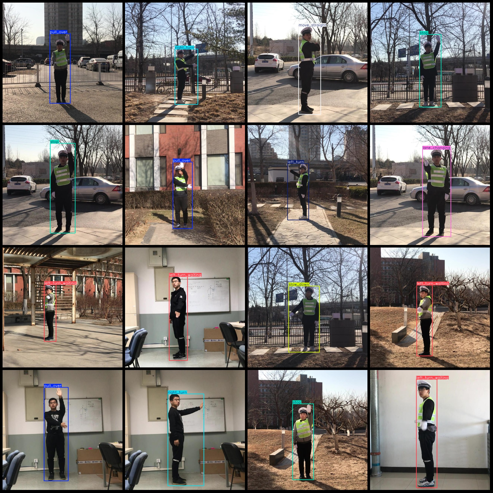
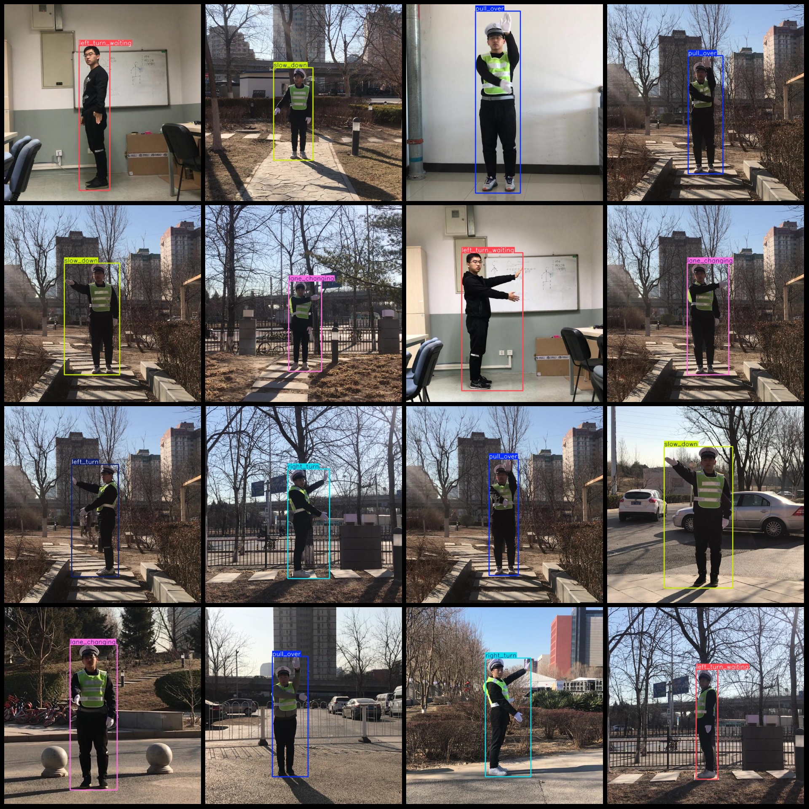

# Traffic Police Gesture Recognition Detection Dataset VOC+YOLO format, 5162 images in 8 categories

Dataset format: Pascal VOC format + YOLO format (without split path in txt file, only contain jpg images and corresponding VOC format xml files and yolo format txt files)

Number of images (jpg file count): 5162
Number of annotations (xml file count): 5162
Number of annotations (txt file count): 5162
Number of annotation categories: 8
Annotation category names (note that the order of categories in the yolo format does not correspond to this, but is based on the labels folder classes.txt): ["lane_changing","left_turn",
"left_turn_waiting","move_straight","pull_over","right_turn","slow_down","stop"]

Number of bounding boxes per category:
- lane_changing (changing lanes) = 682, occupied by images = 682
- left_turn (turning left) = 697, occupied by images = 696
- left_turn_waiting (waiting for left turn) = 625, occupied by images = 625
- move_straight (moving straight) = 609, occupied by images = 609
- pull_over (stopping at a stop sign) = 688, occupied by images = 688
- right_turn (turning right) = 697, occupied by images = 697
- slow_down (decelerating) = 773, occupied by images = 772
- stop (stopping) = 393, occupied by images = 393
Total bounding boxes: 5164
Image resolution: 640x640
Annotation tool used: labelImg
Annotation rules: draw rectangles for each category
Important note: No training/validation/test sets are divided for this dataset; you will need to do so yourself.
Special declaration: This dataset does not guarantee any accuracy in the trained models or weight files.

Image preview:
## Images

Here is a pay link on Stripe ( https://buy.stripe.com/3cs8yP7sY87d0vu9AB ). Please contact me lonlonago@foxmail.com after funding $89, and I will send you a complete data files , thank you!

